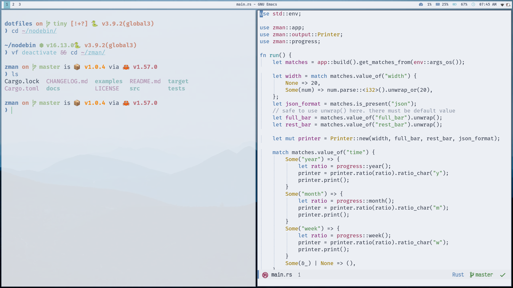
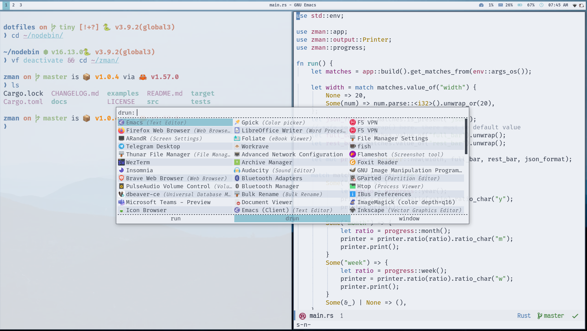

<div align="center">
<h1>.dotfiles</h1>


My personal .dotfiles 🗃️

<a href="https://github.com/azzamsa/dotfiles/workflows/ci.yml">
    
</a>

</div>

---

<p align="center"></p>
<p align="center"></p>

## Features

- Bright, clean, minimalist design.
- Keep your anonymity. No credential is shown anywhere.
- uniformity color of the terminal, window manager, status, and command runner.
- More ...

## Usage

``` bash
$ # clone the repository
$ git clone https://github.com/azzamsa/dotfiles ~/dotfiles/

$ # let GNU stow handle the symlink
$ for d in ~/dotfiles/*/ ; do
    stow "$d" --no-folding
done
```

## Notes

This repo only hold currently used config. For old config visit the `archive` branc.

## Contribution

I don't plan to accept any contribution that adds new functionality. But it is OK for fixes and improvement. I don't recommend using this repository directly. Instead, use it as a source of inspiration.

### Credits

- [Nord Theme](https://www.nordtheme.com/)
- [Noto Emoji](https://github.com/googlefonts/noto-emoji) by Google
